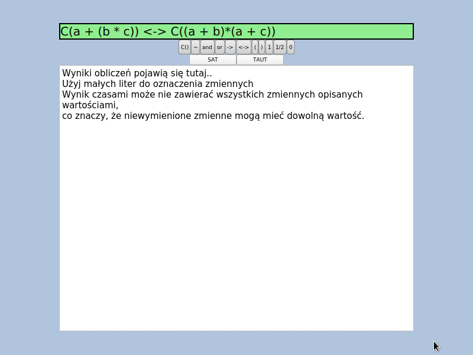

# Weryfikator wyrażeń logiki LSB3 / LSB3 logic formula verification app



English below

Aplikacja służy do sprawdzania spełnialności
i tautologiczności formuł logiki LSB3
autorstwa dr Janusza Wesserlinga.

Udostępnia ona graficzny interfejs
do wprowadzania formuł, jak również
interfejs w postaci biblioteki.

Przykładowe formuły logiki LSB3:
 - `C(a -> b) -> C(b)`
 - `~C(a /\ ~a)`

### Instalacja i uruchamianie
Wymagania:
 - Stack
 - Qt5

Budowanie projektu:
```
stack build
```
Uwaga: aby poprawnie zbudować aplikację
w systemie operacyjnym Windows należy
zmodyfikować plik `stack.yaml`
podając w nim ścieżkę do biblioteki Qt.

Uruchomienie aplikacji graficznej:
```
stack exec app-thesis
```

### Testowanie
Testy jednostkowe oraz własnościowe uruchamia się poleceniem:
```
stack test
```

Do uruchomienia testów wydajnościowych należy najpierw
zbudować projekt, wygenerować przykłady oraz uruchomic testowanie:
```
stack build
stack exec generator-thesis
stack bench --ba="-o raport.html"
```
Po ich zakończeniu zostanie wygenerowany raport w pliku `raport.html`.
Generowanie przypadków testowych jest opcjonalne, w repozytorium
znajdują się przykładowe.

## English

Application which can verify
whether given LSB3 logic formula
is satisfiable or is tauthology.

Example formulas of this logic:
 - `C(a -> b) -> C(b)`
 - `~C(a /\ ~a)`

### Installation and running
Requirements:
 - Stack
 - Qt5

Build the project:
```
stack build
```

Note: in order to build on Windows,
you should modify `stack.yaml` file
and enter Qt path.

Run the GUI application:
```
stack exec app-thesis
```

### Testing
Unit and property testing can be run by this command:
```
stack test
```

In order to run benchmark, you should build
whole project, run test case generator and then run benchmark:
```
stack build
stack exec generator-thesis
stack bench --ba="-o raport.html"
```
After the last command, report will be generated in file `raport.html`.
Generation can be ommited, there are some test cases in repository.
